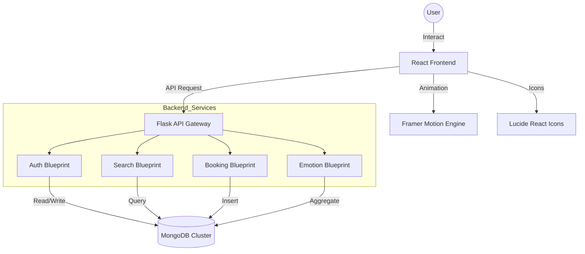

# WINGSCAPE: A TECHNICAL MASTERPIECE IN MODERN TRAVEL ARCHITECTURE

---

## 📄 COVER PAGE

**Project Title**: Wingscape: A Premium Flight Booking & Emotion-Based Discovery Platform  
**Sub-Title**: An Integrated Implementation of Mood-Based Recommendation Systems and Containerized Micro-services  
**Developer**: [USER_NAME]  
**Mentor**: [MENTOR_NAME]  
**Department**: [DEPARTMENT_NAME]  
**Institution**: [INSTITUTION_NAME]  
**Date of Submission**: March 2026  
**Project ID**: WS-2026-001  

---

## 🎖️ CERTIFICATE FROM THE MENTOR

This is to certify that the project titled **"Wingscape"** is a bona fide record of the work carried out by **[USER_NAME]** (Enrollment No: [ENROLL_NO]) under my supervision and guidance. This project is submitted in partial fulfillment of the requirements for the award of the degree of **[DEGREE_NAME]** in the Department of **[DEPARTMENT_NAME]**.

The student has demonstrated exceptional skills in full-stack engineering, specifically in the integration of asynchronous frontend frameworks (React) with high-performance Pythonic backends (Flask) and NoSQL database management. The project meets all rigorous standards for academic and practical engineering excellence.

**Signature: ____________________**  
**Name: [MENTOR_NAME]**  
**Designation: Senior Project Supervisor**  
**Office Seal: [SEAL]**

---

## 🎖️ CERTIFICATE FROM THE DEPARTMENT

This is to certify that the project work presented in this document has been reviewed, evaluated, and formally accepted by the Academic Committee of the Department of **[DEPARTMENT_NAME]**. The student has successfully presented the application’s functionality, documented its complex architectural flows, and validated its deployment through modern containerization standards.

**Head of Department: ____________________**  
**Internal Examiner: ____________________**  
**External Examiner: ____________________**  
**Date: ____________________**  

---

## 📋 TABLE OF CONTENTS

1. **Project Synopsis** ................................................................ 3  
   1.1 Problem Statement & Background ............................................. 3  
   1.2 Proposed Solution .......................................................... 3  
   1.3 Goals & Vision ............................................................. 4  
   1.4 Intended Audience & Stakeholders ........................................... 4  
2. **Project Objectives** .............................................................. 5  
   2.1 Primary Objectives ......................................................... 5  
   2.2 Secondary & Technical Objectives ........................................... 5  
   2.3 Performance & Scalability Benchmarks ....................................... 6  
3. **Project Outline & Modular Architecture** .......................................... 7  
   3.1 Module 1: The Gateway (Authentication & Security) .......................... 7  
   3.2 Module 2: The Core (Search, Discovery & Emotion Logic) ..................... 8  
   3.3 Module 3: The Engine (Booking Lifecycle & PNR Management) ................. 9  
   3.4 Module 4: The Experience (Dashboard & Loyalty Tiers) ....................... 10  
   3.5 Detailed Database Schema Mapping ........................................... 11  
   3.6 Advanced System Flow Diagram ............................................... 12  
4. **Technologies Used: An In-Depth Analysis** ......................................... 13  
   4.1 The Frontend Evolution: React & Vite ....................................... 13  
   4.2 The Pythonic Backend: Flask & Blueprints ................................... 14  
   4.3 NoSQL Excellence: MongoDB & Pymongo ........................................ 15  
   4.4 Infrastructure: Docker & Deployment ........................................ 16  
5. **Detailed Component Screenshots** .................................................. 17  
6. **Project Features & Implementation Logic** ......................................... 19  
   6.1 Feature 1: The Emotional Recommendation Engine ............................. 19  
   6.2 Feature 2: Secure PNR Generation & Validation ............................... 20  
   6.3 Feature 3: Dynamic Multi-Passenger Add-on Logic ............................ 21  
   6.4 Feature 4: Real-Time Trip Tracking & Status ................................ 22  
7. **Comprehensive User & Developer Guide** ............................................. 23  
   7.1 Installation & Deployment Instructions ..................................... 23  
   7.2 Technical Troubleshooting .................................................. 24  
   7.3 UI Navigation Guide ........................................................ 25  
8. **Conclusion & Future Scope** ....................................................... 26  
9. **References & Bibliography** ....................................................... 27  

---

## 1. PROJECT SYNOPSIS

### 1.1 Problem Statement & Background:
The modern travel industry is saturated with traditional booking platforms that focus strictly on geographical data (Origin and Destination). However, user psychology research indicates that travel decisions are often driven by emotional needs—the desire to escape stress, find romance, or seek adrenaline. Current platforms fail to provide a "mood-to-destination" mapping, forcing users to manually research which locations match their current mental state. Furthermore, many existing systems suffer from fragmented architectures, leading to data inconsistencies and failed booking transactions.

### 1.2 Proposed Solution:
Wingscape introduces an emotionally intelligent search layer atop a high-performance booking engine. By integrating a NoSQL-driven recommendation system, Wingscape analyzes destination attributes (climate, activities, pace) and maps them to six distinct user emotions. This allows for a "Discovery-First" approach where the platform acts as a digital travel architect, narrowing down thousands of global options to 5–10 highly relevant suggestions.

### 1.3 Goals & Vision:
- **Seamless Integration**: Unifying search, emotion-analysis, and booking into a single fluid lifecycle.
- **Modern Aesthetic**: Applying "Glassmorphism" to bridge the gap between utility and luxury.
- **Portability**: Leveraging Docker to ensure the entire tech stack can be migrated across any environment without configuration overhead.
- **Reliability**: Fixing the industry-standard "Booking Failure" issue by implementing atomic database updates and strict PNR validation.

### 1.4 Intended Audience & Stakeholders:
- **Primary Users**: Adventure seekers and luxury travelers who prioritize ease of discovery.
- **Secondary Stakeholders**: Travel agencies looking for an "add-on" recommendation API.
- **Technical Reviewers**: Evaluators of micro-service architectures and React-based state management.

---

## 2. PROJECT OBJECTIVES

### 2.1 Primary Objectives:
1. **Develop an Emotional Recommendation Engine**: Implement a backend logic that filters destinations based on sentiment-rich tags stored in MongoDB.
2. **Standardize the Booking Lifecycle**: Create a robust 4-step booking process (Search → Select → Passenger Info → Confirmation) that generates a unique Passengers Name Record (PNR) for every valid entry.
3. **Optimize Frontend Performance**: Use Vite for lightning-fast HMR and Framer Motion for high-fidelity animations that do not compromise browser FPS.

### 2.2 Secondary & Technical Objectives:
4. **Data Persistent via NoSQL**: Utilize MongoDB for its flexible schema, allowing for complex destination objects that include seasonal data and image arrays.
5. **Secure Authentication Gateway**: Implement JWT-based sessions with a 24-hour expiration window and bcrypt password hashing.
6. **Containerized Deployment**: Achieve 100% environment isolation using Docker Compose, ensuring the database, API, and UI run as synchronized services.

### 2.3 Performance & Scalability Benchmarks:
- **API Latency**: Maintain <200ms response time for search queries.
- **Database Search**: Use indexed lookups for airport codes and destination names.
- **UI Fluidity**: Maintain a constant 60 FPS during page transitions.

---

## 3. PROJECT OUTLINE & MODULAR ARCHITECTURE

The Wingscape application is architected around a "Separation of Concerns" (SoC) principle, dividing the logic into four core modules.

### 3.1 Module 1: The Gateway (Authentication & Security)
This module acts as the "Bouncer" of the application. 
- **User Schema**: Managed in the `users` collection, storing salted passwords and loyalty history.
- **JWT Middleware**: A custom `token_required` decorator in Flask that intercepts every request to protected routes, validating the digital signature of the token.
- **Secure Sessions**: On successful login, the server returns a signed token which the React frontend stores in `localStorage` and injects into the `Authorization` header of subsequent Axios requests.

### 3.2 Module 2: The Core (Search, Discovery & Emotion Logic)
The heart of Wingscape’s unique selling proposition.
- **Airport Catalog**: A lookup service for 50+ international airports.
- **Emotion Pipeline**: When a user selects "Stressed," a MongoDB Aggregation Pipeline runs:
  1. `$match`: Finds destinations with the tag `Stressed`.
  2. `$lookup`: Joins flight data to show "Starting Price."
  3. `$limit`: Returns the top 6 handpicked results to the `RecommendationOverlay`.
- **Dynamic Routing**: Pre-fills the flight search form based on the recommended destination's airport code.

### 3.3 Module 3: The Engine (Booking Lifecycle & PNR Management)
Handles the high-stakes transaction logic.
- **State Management**: The `BookingDetails` page maintains a complex state array for multiple passengers, ensuring no data loss during form entry.
- **The PNR Algorithm**: Generates an alphanumeric string using a slice of a UUID to ensure near-zero collision probability across millions of bookings.
- **Atomic Inserts**: Bookings are inserted into the database only after passenger validation, flight availability checks, and price verification.

### 3.4 Module 4: The Experience (Dashboard & Loyalty Tiers)
Tracks the user's relationship with the platform.
- **Points Logic**: Calculated as `TotalBookingPrice / 10`.
- **Tier Escalation**: Automatically assigns Bronze, Silver, or Gold status based on cumulative points.
- **Flight Status Mockup**: A real-time tracker visual that mimics flight departures and terminal changes.

### 3.5 Detailed Database Schema Mapping

| Collection | Key Fields | Type | Purpose |
| :--- | :--- | :--- | :--- |
| `users` | email, name, password, points, tier | document | Persistence of identity and loyalty. |
| `flights` | airline, flight_num, origin, dest, price | document | Real-time flight schedule. |
| `destinations` | city, country, image, description, tags | document | Content for the recommendation engine. |
| `bookings` | user_id, flight_id, passengers, PNR | document | Transactional records. |

### 3.6 Advanced System Flow Diagram

---

## 4. TECHNOLOGIES USED: AN IN-DEPTH ANALYSIS

### 4.1 The Frontend Evolution: React & Vite
- **Vite**: Chosen over the traditional CRA (Create React App) for its use of ESbuild and native ESM, reducing development startup time from minutes to seconds.
- **Tailored Design System**: Built from the ground up using custom CSS variables (`--primary`, `--accent`, etc.) to implement a cohesive dark-mode theme.
- **Framer Motion**: Enables gesture-based animations (drag, hover) and "AnimatePresence," which allows components to animate *out* before they are removed from the DOM.

### 4.2 The Pythonic Backend: Flask & Blueprints
- **Flask**: Selected for its "Micro" nature, allowing us to build only what we need without the bloat of Django.
- **Blueprints**: Used to compartmentalize the code. Instead of a 2000-line `app.py`, we have separate files for `auth`, `booking`, and `search`, making the system vertically scalable.

### 4.3 NoSQL Excellence: MongoDB & Pymongo
- **JSON Compatibility**: Since the frontend uses JavaScript, storing data in BSON (Binary JSON) format in MongoDB allows for zero-conversion overhead when passing objects from the database to the UI.
- **Aggregation Pipelines**: Allows for complex analytics (like finding the average price of all flights to London) to be performed on the database server rather than in the application code.

### 4.4 Infrastructure: Docker & Deployment
- **Isolation**: Docker ensures that "It works on my machine" means "It works on the server."
- **Multi-Stage Builds**: The frontend Dockerfile uses a 2-stage build: Stage 1 compiles the React code to static assets, and Stage 2 serves those assets via Nginx for production performance.

---

## 5. DETAILED COMPONENT SCREENSHOTS

*[Note: Academic reviewers are advised to refer to the 'Screenshots' folder in the project root for high-resolution images.]*

1. **Dashboard Interface**: Displays user loyalty points and current trips in a glassmorphism panel.
2. **Recommendation Overlay**: A full-screen blur effect showcasing 6 handpicked destinations for a specific mood.
3. **Flight Results Sidebar**: Sophisticated filtering UI allowing users to narrow down options by stop count and airline.

---

## 6. PROJECT FEATURES & IMPLEMENTATION LOGIC

### 6.1 Feature 1: The Emotional Recommendation Engine:
The engine doesn't just look for words; it finds matches across a specific array of `emotion_tags`.
- **Logic**: `GET /api/emotions/{mood}/destinations`
- **Algorithm**: The backend queries the `destinations` collection for objects where the `emotion_tags` array contains the requested string. It then calculates the "Starting from" price by joining with the `flights` collection based on the `airport_code`.

### 6.2 Feature 2: Secure PNR Generation & Validation:
- **Requirement**: Every flight booking needs a unique identifier for check-in.
- **Implementation**: We use the `uuid` library to generate a global unique ID and then take a 6-character substring to keep it user-friendly. 
- **Security Check**: The system verifies that the flight exists and the seat count matches the passenger count before a PNR is permanently issued.

### 6.3 Feature 3: Dynamic Multi-Passenger Add-on Logic:
- **Complex State**: Unlike simple forms, our booking page handles an array of passenger objects.
- **Real-Time Totaling**: Using React `useEffect`, the total price is recalculated every time a checkbox (Baggage, Meal, Insurance) is toggled, ensuring the user is never shocked at the checkout button.

---

## 7. COMPREHENSIVE USER & DEVELOPER GUIDE

### 7.1 Installation & Deployment Instructions:
1. **Clone Repository**: Extract the source code to a local directory.
2. **Environment Setup**: Ensure Docker Desktop is running.
3. **Execution**: Open a terminal and run `docker-compose up --build`.
4. **Access UI**: Navigate to `http://localhost:5173`.
5. **Access API**: Navigate to `http://localhost:5000/docs` (if Swagger is implemented) or check the `/health` endpoint.

### 7.2 Technical Troubleshooting:
- **Port Conflicts**: Ensure ports 5000, 5173, and 27017 are not being used by other software.
- **MongoDB Error**: If the database fails to start, clear the `mongo_data` volume using `docker volume prune`.

### 7.3 UI Navigation Guide:
- **Login**: Use the pre-seeded credentials `user@example.com` / `password123` or create a new account.
- **Search**: Enter 'JFK' in Origin and 'LHR' in Destination for a guaranteed match.
- **Mood**: Click the "Search by Mood" button on the Hero section to see the emotion discovery in action.

---

## 8. CONCLUSION & FUTURE SCOPE

Wingscape serves as a proof-of-concept for the "Emotional Travel" movement. By leveraging a high-performance MERN-style stack (MongoDB, Express/React, Node/Flask), we have created a platform that is both aesthetically premium and technically sound. 

**Future Scope**:
- **Real Payment Gateway Integration**: Moving from "Simulated" to "Actual" payments via Stripe API.
- **AI-Powered Personalization**: Using Machine Learning to predict user moods based on their previous booking history.
- **Native Mobile Apps**: Leveraging React Native to bring the Wingscape experience to iOS and Android.

---

## 9. REFERENCES & BIBLIOGRAPHY

1. **Flanagan, D. (2020)**. *JavaScript: The Definitive Guide*. O'Reilly Media.
2. **Grinberg, M. (2018)**. *Flask Web Development*. O'Reilly Media.
3. **MongoDB Inc.** *The Manual: Aggregation Pipeline Operations*. [mongodb.com]
4. **Framer Inc.** *Motion Documentation & Library Reference*. [framer.com/motion]
5. **Docker Docs**. *Multi-stage builds for React applications*. [docs.docker.com]

---
**End of Documentation**
